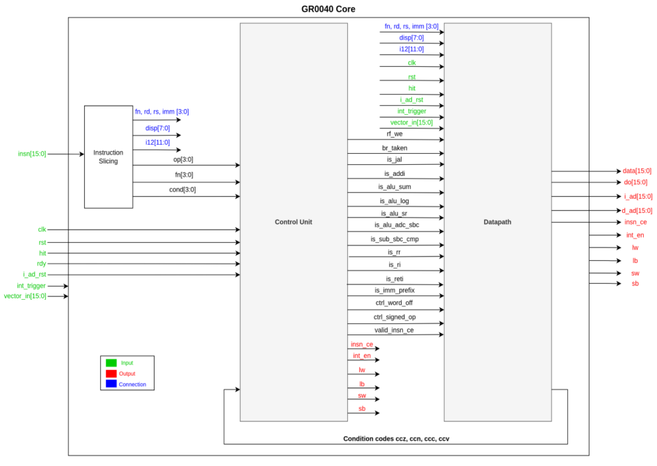
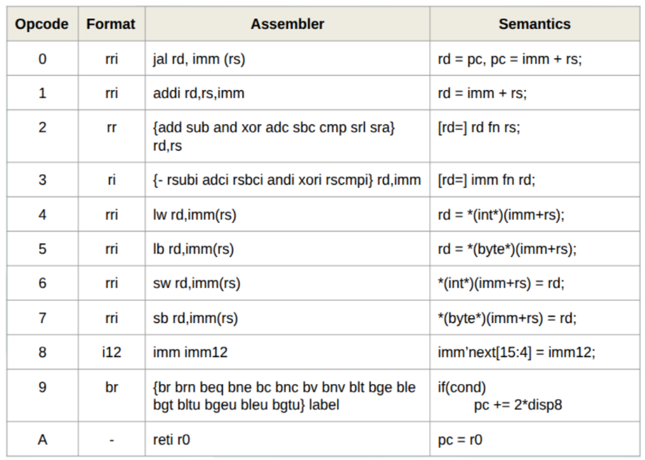
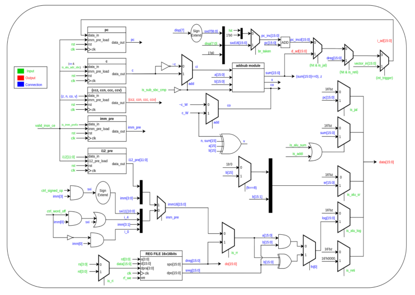
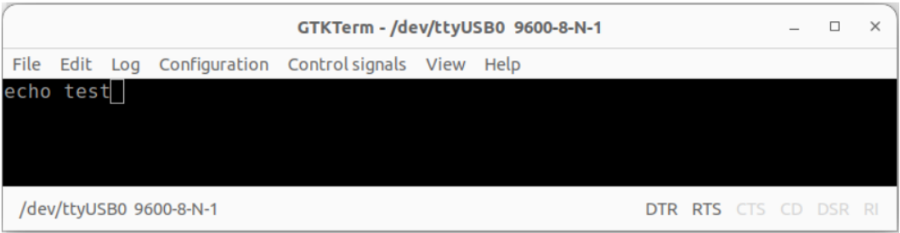

# GR0040-based System-on-Chip

A 16-bit RISC System-on-Chip designed from scratch in Verilog, synthesized and verified on a **Zybo Z7-10 FPGA** board.



## Overview

The system is built around the **GR0040**, a 16-bit RISC processor core originally designed by [Jan Gray](http://fpgacpu.org/gr/index.html). The project involved:

- **Refactoring** the original monolithic design into a clean **Control Unit / Datapath** separation model
- **Extending** the ISA with a `RETI` instruction for interrupt support
- **Designing** the **GR0041** wrapper for non-nested interrupt management
- **Building** a complete SoC with memory-mapped peripherals and a custom peripheral bus

## Architecture

| Component | Description |
|---|---|
| **GR0040** | 16-bit RISC core — two-operand, load-store, non-pipelined |
| **GR0041** | Interrupt wrapper — enforces non-nested ISR execution |
| **Memory** | 1 KB dual-port Block RAM (byte-addressable, 16-bit address space) |
| **Timer/Counter** | 16-bit with configurable mode (timer/counter) and interrupt on overflow |
| **GPIO** | 8-bit parallel I/O port |
| **UART** | Full-duplex serial communication with configurable baud rate |
| **Interrupt Controller (PIC)** | Priority-based arbitration for up to 8 sources, write-1-to-clear |
| **Peripheral Bus** | Encoder/decoder abstraction for modular peripheral integration |

### Instruction Set

The ISA supports 11 opcodes across 5 instruction formats (register-register, register-immediate, register-register-immediate, 12-bit immediate, and branch).



### Datapath



### Memory Map

| Address Range | Region |
|---|---|
| `0x0000 – 0x001F` | Interrupt vector table |
| `0x0020 – 0x03FF` | Code & Data (1 KB) |
| `0x8000 – 0x80FF` | Timer/Counter registers |
| `0x8100 – 0x81FF` | GPIO registers |
| `0x8200 – 0x82FF` | Interrupt Controller registers |
| `0x8300 – 0x83FF` | UART registers |

## Repository Structure

```
├── rtl/                    # Verilog source files
│   ├── core/               # Processor core
│   │   ├── gr0040.v        # CPU top-level (instruction slicing + CU/DP instantiation)
│   │   ├── controlUnit.v   # Control Unit
│   │   ├── datapath.v      # Datapath (ALU, register file, PC logic)
│   │   └── defines.vh      # ISA constants and macros
│   ├── system/             # System-level modules
│   │   ├── gr0041.v        # Interrupt wrapper
│   │   └── soc.v           # Top-level SoC integration
│   ├── peripherals/        # Memory-mapped peripherals
│   │   ├── timer.v         # 16-bit Timer/Counter
│   │   ├── pario.v         # 8-bit Parallel I/O
│   │   ├── pic.v           # Interrupt Controller
│   │   ├── UartController.v
│   │   ├── BaudRateGen.v
│   │   ├── UartReceiver.v
│   │   └── UartTransmitter.v
│   └── bus/                # Peripheral bus
│       ├── ctrl_enc.v      # Bus encoder
│       └── ctrl_dec.v      # Bus decoder
├── assembler/              # Python assembler toolchain
│   ├── assembler.py        # Assembler (ASM → .coe)
│   └── codigo.asm          # Test program
├── constraints/            # FPGA constraints
│   └── zybo_z7.xdc         # Pin mapping for Zybo Z7-10
├── mem/                    # Memory initialization
│   ├── ramh.coe            # High-byte initialization
│   └── raml.coe            # Low-byte initialization
└── docs/                   # Documentation & images
    ├── report.pdf
    └── images/
```

## Verification

The system was verified on hardware with a test program that exercises all peripherals simultaneously:

1. **UART echo** — characters received over serial (9600 baud) are echoed back to the host terminal
2. **Timer interrupt** — an LED toggles every 500 timer overflows (visually observable blink)
3. **GPIO interrupt** — a second LED toggles on each push-button press



## Tools & Target

- **HDL:** Verilog
- **IDE:** Xilinx Vivado 2025.1
- **Board:** Digilent Zybo Z7-10 (Zynq-7010)
- **Assembler:** Python 3

